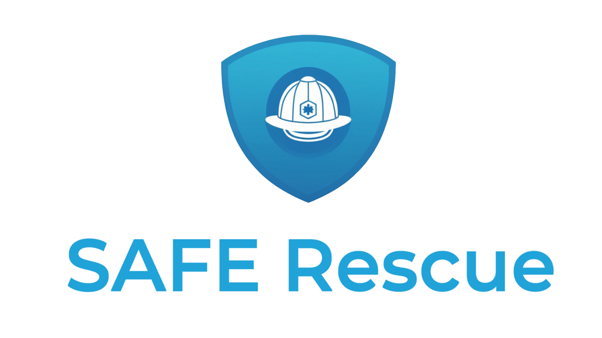

# SAFE Rescue

*Gestión eficiente y rápida de incidentes en situaciones de emergencia.*

  

SAFE Rescue es una aplicación diseñada para la gestión eficiente y rápida de incidentes en situaciones de emergencia. Esta herramienta permite a los equipos de respuesta coordinar recursos, monitorear el desarrollo de incidentes y tomar decisiones informadas en tiempo real. Con un enfoque en la seguridad y la comunicación efectiva, SAFE Rescue optimiza la respuesta a emergencias y ayuda a mitigar los riesgos en situaciones críticas.

---

## Últimos cambios

### ❚❙❘ VERSIÓN 1.6

>  • Se cambió la funcionalidad de "Recordarme": ahora permite mantener la sesión iniciada al reabrir la app (no solo recordar el usuario).
>  • Se ajustó AuthViewModel y NavGraph para que la restauración de sesión y la navegación funcionen sin bucles ni conflictos.
>  • Se corrigió un Scaffold que provocaba duplicado del AppTopBar y del BottomNavigationBar en el NavGraph.
>  • Se mejoró el estilo de la pantalla de inicio de sesión: colores, espaciado y presentación para un inicio más agradable.
>  • Se actualizaron los colores del TopBar y del BottomNavigationBar a los colores de la marca.
>  • Se unificó la instancia del AuthViewModel entre NavGraph y la pantalla de login para evitar estados desincronizados.
>  • Archivos modificados verificados; prueba: login SIN “Recordarme” (debe volver al login al reiniciar) y CON “Recordarme” (debe mantenerse la sesión).
>   > > > Terminar de desarrollar la función de Incidentes.
>   > > > Mejorar barra de notificaciones y agregar logica de creacion de notificaciones solo para el administrador.

---

## Características Principales

### Coordinación y Comunicación Centralizada
La comunicación oportuna hace la diferencia. SAFE Rescue proporciona un canal de comunicación unificado que permite a las centrales de alarma y a los equipos en terreno estar perfectamente sincronizados, asegurando que la información crítica llegue a quien la necesita sin demoras.

  

### Gestión de Recursos en Terreno
La valentía y la preparación salvan vidas. La aplicación equipa a los bomberos y personal de emergencia con herramientas para visualizar la ubicación de los recursos, actualizar el estado de los incidentes y recibir instrucciones claras, optimizando cada segundo de la operación.

  

## Tecnologías Utilizadas
* **Kotlin**
* **Jetpack Compose**
* **SQLite/Room**

 

  

