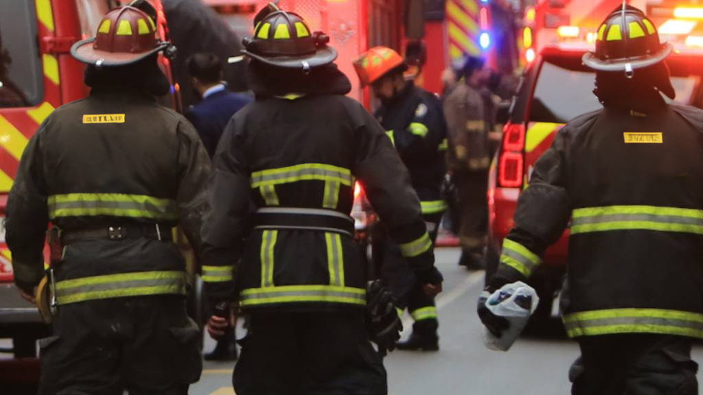

# SAFE Rescue

*Gestión eficiente y rápida de incidentes en situaciones de emergencia.*

  

SAFE Rescue es una aplicación diseñada para la gestión eficiente y rápida de incidentes en situaciones de emergencia. Esta herramienta permite a los equipos de respuesta coordinar recursos, monitorear el desarrollo de incidentes y tomar decisiones informadas en tiempo real. Con un enfoque en la seguridad y la comunicación efectiva, SAFE Rescue optimiza la respuesta a emergencias y ayuda a mitigar los riesgos en situaciones críticas.

---

## Últimos cambios

### ❚❙❘ VERSIÓN 1.9-Pre-Alpha

>  • Se integro la API Nativa de gps para que los nuevos incidentes tengan ubicación basada en el gps.
>  • Se incluyó un mapa en la pantalla principal que refleja los incidentes usando sus coordenadas.
>  • Se agregó boton de Cerrar sesión al menu lateral.
>  • Ahora podemos incluir las coordenadas para los incidentes directamente con el gps del celular.
>  • Se ajustó la paleta de colores y se hicieron algunos cambios en el diseño.
>   > > > Modificar estilo del AppDrawer.
>  

---

## Características Principales

### Coordinación y Comunicación Centralizada
La comunicación oportuna hace la diferencia. SAFE Rescue proporciona un canal de comunicación unificado que permite a las centrales de alarma y a los equipos en terreno estar perfectamente sincronizados, asegurando que la información crítica llegue a quien la necesita sin demoras.

  

### Gestión de Recursos en Terreno
La valentía y la preparación salvan vidas. La aplicación equipa a los bomberos y personal de emergencia con herramientas para visualizar la ubicación de los recursos, actualizar el estado de los incidentes y recibir instrucciones claras, optimizando cada segundo de la operación.

  

## Tecnologías Utilizadas
* **Kotlin**
* **Jetpack Compose**
* **SQLite/Room**

 

  

